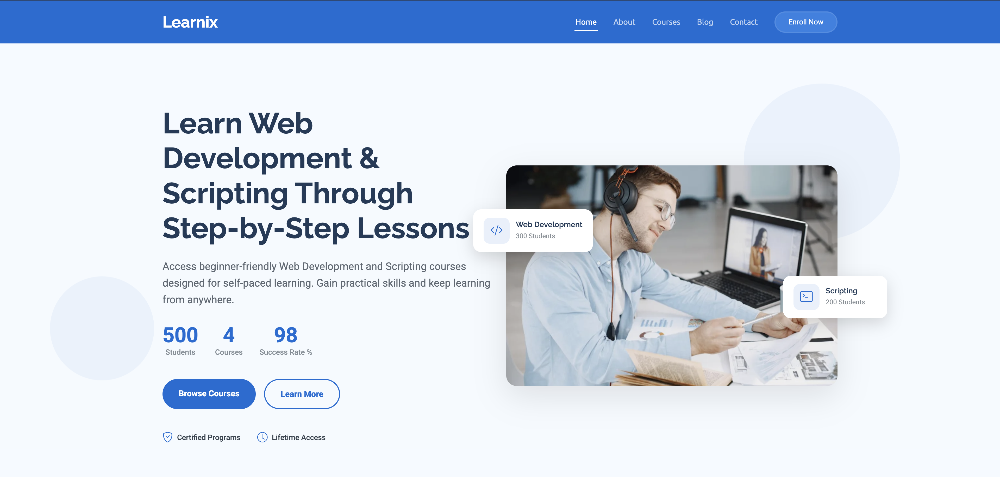
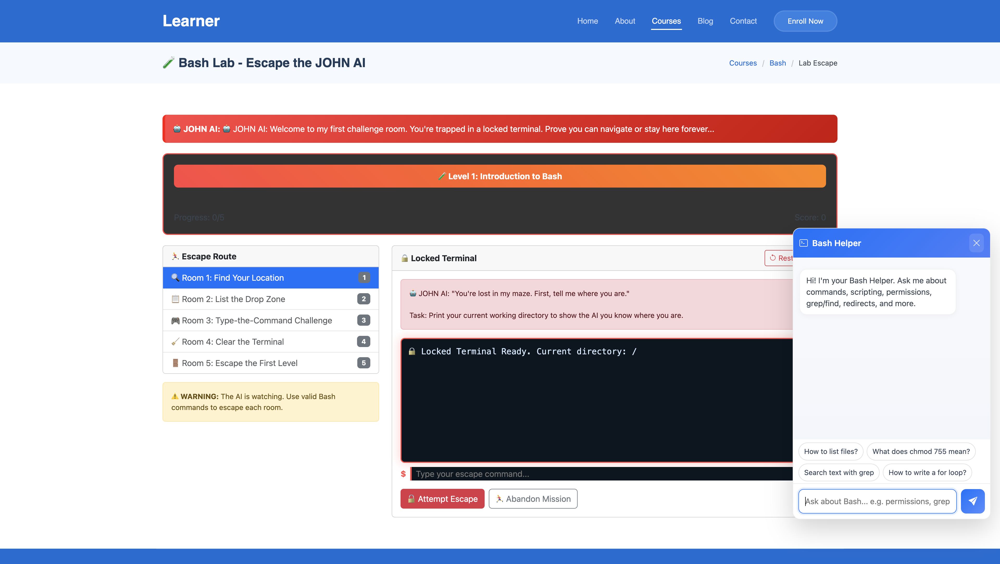
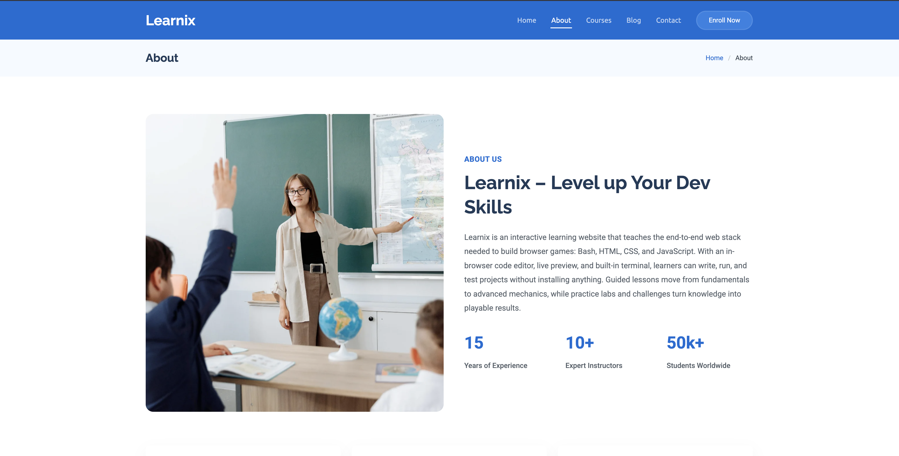
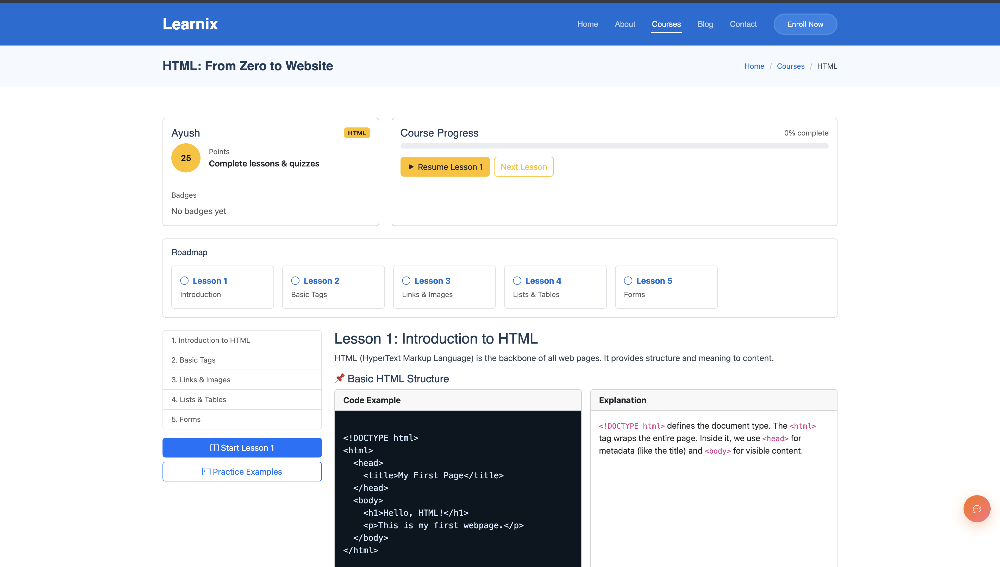
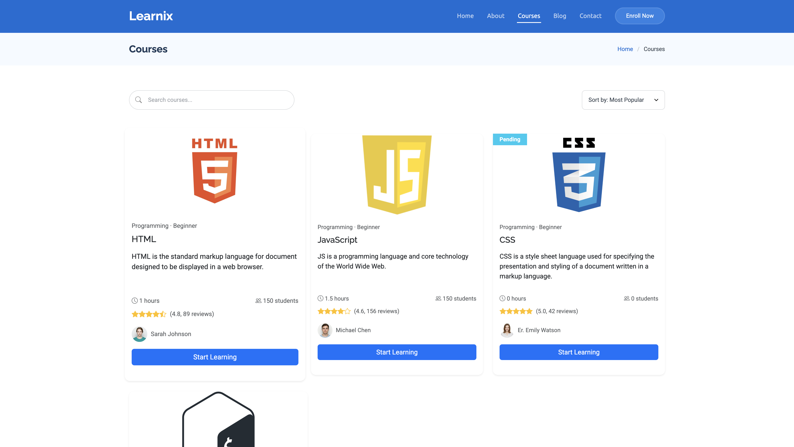

# Learnix
##  Project Description

**Learnix** is an interactive learning platform designed to teach the fundamentals of **HTML, CSS, JavaScript, and Bash** in a beginner-friendly way.  
It provides step-by-step lessons, coding challenges, and small projects that learners can edit and run directly in the browser, making it easy to practice and understand programming concepts.  

###  Features
-  Structured lessons for **HTML, CSS, JavaScript, and Bash**
-  Built-in code editor with live preview
-  Interactive practice challenges with next/previous navigation
-  Mini-projects (games & tools) to reinforce learning
-  Beginner-friendly, no installation or setup required

## ⚙️ Setup Instructions

1. Clone the repository:
   ```bash
       git clone https://github.com/SonamChhiringSherpa/Website-Development.github

2. Navigate into the project folder

       cd Learnix

3.Open index.html in your browser to start learning.

         No installation required (pure HTML, CSS, JS, and Bash lessons run in-browser)


## Contributors

- [Sonam Chhiring Sherpa](https://github.com/SonamChhiringSherpa) –  html course , Project Lead

- [Saket Yadav](https://github.com/saket-yadav) – JavaScript Challenges, Documentation

- [Papit Ghimire](https://github.com/papit-stack) – bash Challenges, Documentation

- [Prashant singh](https://github.com/Prashant-singh23) – blog, about us 

- [siddharth shrestha](https://github.com/evader5731) – home 


## 📸 Screenshots

### Homepage


### bash-challenge


### about


### html-lessons


### course section


### contact page


