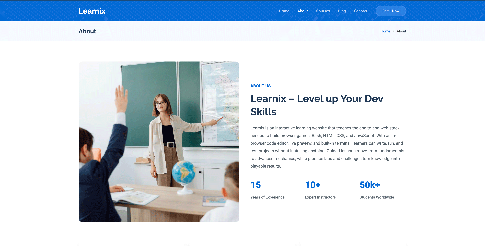
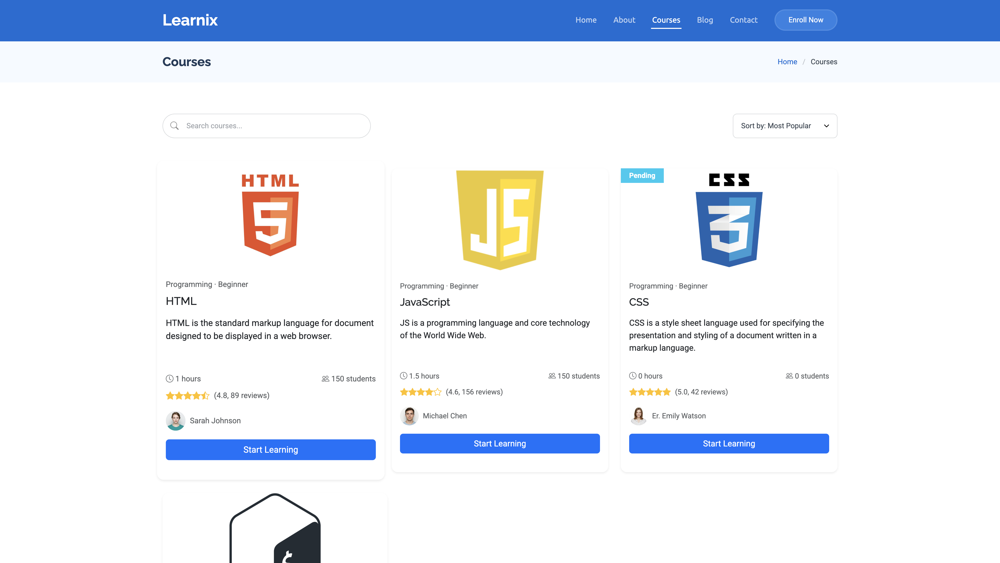
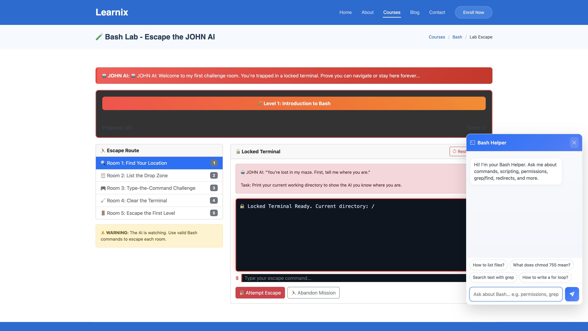
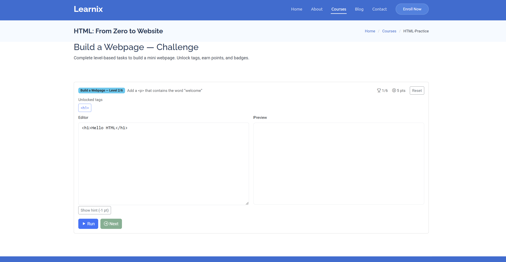
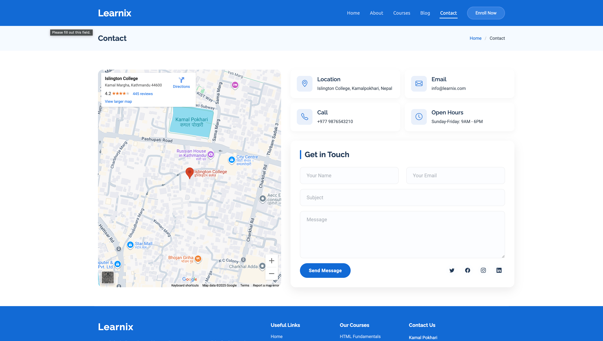

## 🚀 Learnix — Django Learning Platform

Learnix is a modern, multi-app Django platform for learning and content publishing. It includes courses, blogs, portfolios, and account flows with a clean template-driven UI and static assets ready to go.

- **Python**: 3.13
- **Django**: 5.2.x
- **Database**: SQLite (default for local)

### ✨ Features
- **Courses & Lessons**: Structured learning pages and practice sections
- **Blog**: Author profiles, images, and article pages
- **Portfolio**: Showcase projects with images and details
- **Accounts**: Registration, password reset, and enrollment flows
- **Static + Media**: Organized `static/` assets and `media/` uploads

---

## 🌐 Live Demo (Render)

- Click here for live demo : [https://learnix-nuwo.onrender.com/](https://learnix-nuwo.onrender.com/)
  
If you’d like to deploy your own instance, see the Render guide below.

---

## 🗂️ Project Structure

- `project/` — Django config (`settings.py`, `urls.py`, `wsgi.py`, `asgi.py`)
- `accounts/` — authentication & account-related views/URLs
- `app/` — core pages and forms
- `blog/` — posts, authors, and media
- `courses/` — courses and lessons
- `portfolio/` — portfolio items and details
- `static/` — CSS, JS, images, vendor assets
- `template/` — HTML templates (base, partials, pages)
- `media/` — uploaded images (authors, blog, portfolio, projects)

---

## ⚙️ Local Development

1) Clone
```bash
git clone <your-fork-or-repo-url>
cd Learnix
```

2) Create & activate a virtualenv
```bash
python -m venv .venv
# PowerShell
. .venv\Scripts\Activate.ps1
# cmd
.venv\Scripts\activate.bat
```

3) Install dependencies

 If you have a `requirements.txt`, use it. Otherwise install the essentials:
```bash

# If you have requirements.txt, prefer that
pip install "django>=5.2,<6.0" pillow sqlparse tzdata gunicorn
```

4) Migrate database
```bash
python manage.py migrate
```

5) Create admin user (optional)
```bash
python manage.py createsuperuser
```

6) Run server
```bash
python manage.py runserver
```
Visit `http://127.0.0.1:8000/`.

---

## 📦 Deploy on Render

You can deploy Learnix on Render as a Web Service.

1) Push your repo to GitHub/GitLab
2) On Render, create a “Web Service” and connect the repo
3) Set the environment:
   - Environment: `Python`
   - Build Command:
     ```bash
     pip install --upgrade pip
     pip install "django>=5.2,<6.0" pillow sqlparse tzdata gunicorn
     python manage.py collectstatic --noinput
     python manage.py migrate
     ```
   - Start Command:
     ```bash
     gunicorn project.wsgi:application
     ```
4) Configure app settings in `project/settings.py` for production:
   - `DEBUG = False`
   - `ALLOWED_HOSTS = ["<your-service-name>.onrender.com", "your.custom.domain"]`
5) Optional: Use a persistent database (Render PostgreSQL) for production.

After the first successful deploy, your app will be served at something like:
`https://<your-service-name>.onrender.com`

---

## 🔧 Configuration Notes

- Default local DB is SQLite; no extra setup required.
- For production, set `DEBUG = False` and configure `ALLOWED_HOSTS`.
- Run `python manage.py collectstatic` before serving static files in production.

---

## 🔗 App Routes

- `accounts/urls.py` — register, login, enroll/reset
- `app/urls.py` — home, about, contact
- `blog/urls.py` — blog list and details
- `courses/urls.py` — courses and lessons
- `portfolio/urls.py` — portfolio list and details
- Root router: `project/urls.py`

---

## 🖼️ Screenshots

### 🏠 Homepage


### ℹ️ About


### 📝 Blog


### 📚 Courses


### 💻 Bash Practice


### 🌐 HTML Practice


### ✉️ Contact


---

## 💡 Tips
- Access Django admin at `/admin/` with your superuser
- Keep app-specific templates under `template/` and reference via views
- When adding models: `python manage.py makemigrations && python manage.py migrate`

---

## 👥 Contributors

- [Sonam Chhiring Sherpa](https://github.com/SonamChhiringSherpa) — HTML Course, Project Lead  
- [Saket Yadav](https://github.com/saket-yadav) — JavaScript challenges, Contact us  
- [Papit Ghimire](https://github.com/papit-stack) — Homepage, Bash Course  
- [Prashant Singh](https://github.com/Prashant-singh23) — Blog, Documentation  
- [Siddharth Shrestha](https://github.com/Prashant-singh23) — About Us, Course

---

## 📄 License

This project is provided for educational purposes.
